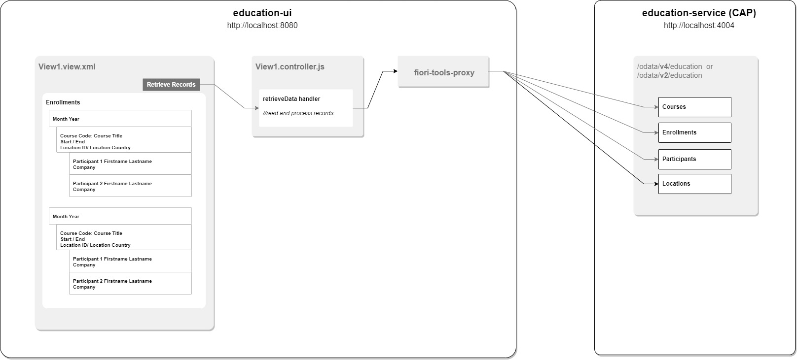
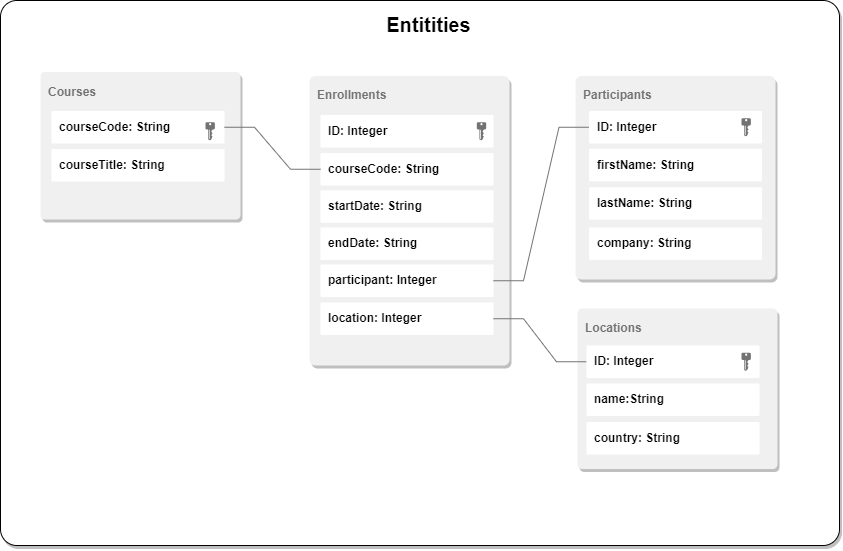

# SAP Course Enrollment Report

A UI5-based application which lists all course enrollments.

Records are mainly grouped by the Month/Year. Under that, all courses happening during that month will be listed, with all its participants.

## Instructions

- Go into each folder (education-service and education-ui), run 'npm install'

- To start the UI, within "education-ui", run "npm start"

- To start the CAP service, within "education-service", run "cds serve"

- To complete the UI
  - Connect the education-ui to the education-service via the fiori-tools-proxy, which can be configured in ui5-local.yaml

  - To configure the odata model in manifest.json

  - To implement the handler in View1.controller to fetch and process the data from education-service

  - To implement the report layout via View1.view.xml

## App Structure

## Entities

